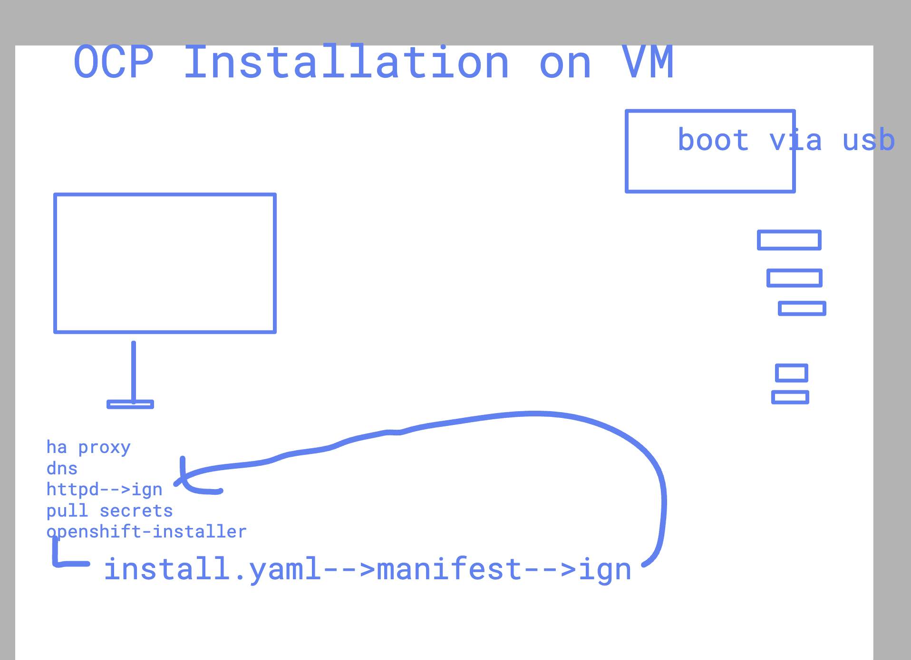

# OpenShift UPI Install Without PXE (USB/ISO Boot)

## Architecture



### Cluster Layout

```text
Infra/Utility Node (Rocky Linux)
  - DNS (named)
  - HTTP (ignition + images)
  - HAProxy (API + ingress)
  - openshift-install

Nodes (boot via USB/ISO)
  - 1 Bootstrap (temporary)
  - 3 Masters (control plane)
  - 2 Workers
```

## 1. Prerequisites (Critical)

### Hardware (Minimum Realistic)

| Node | CPU | RAM | Disk |
| --- | --- | --- | --- |
| Bootstrap | 4 | 8 GB | 120 GB |
| Master (x3) | 4 | 16 GB | 120 GB |
| Worker (x2) | 2-4 | 8-16 GB | 120 GB |

### Network

Use static IPs.

Example:

- Bootstrap: `192.168.1.10`
- Master1: `192.168.1.11`
- Master2: `192.168.1.12`
- Master3: `192.168.1.13`
- Worker1: `192.168.1.14`
- Worker2: `192.168.1.15`
- HAProxy/Utility: `192.168.1.5`

### DNS Records (Very Important)

- `api.ocp.lab.local` -> `192.168.1.5`
- `api-int.ocp.lab.local` -> `192.168.1.5`
- `*.apps.ocp.lab.local` -> `192.168.1.5`
- `bootstrap.ocp.lab.local` -> `192.168.1.10`
- `master1.ocp.lab.local` -> `192.168.1.11`
- `master2.ocp.lab.local` -> `192.168.1.12`
- `master3.ocp.lab.local` -> `192.168.1.13`
- `worker1.ocp.lab.local` -> `192.168.1.14`
- `worker2.ocp.lab.local` -> `192.168.1.15`

## 2. Setup Utility Node (Rocky Linux)

Install required services:

```bash
dnf install httpd haproxy bind bind-utils -y
systemctl enable --now httpd named haproxy
```

## 3. Configure DNS (named)

Edit zone file:

```bash
vi /var/named/ocp.lab.local.zone
```

Example records:

```text
api         IN A 192.168.1.5
api-int     IN A 192.168.1.5
*.apps      IN A 192.168.1.5

bootstrap   IN A 192.168.1.10
master1     IN A 192.168.1.11
master2     IN A 192.168.1.12
master3     IN A 192.168.1.13
worker1     IN A 192.168.1.14
worker2     IN A 192.168.1.15
```

Restart DNS:

```bash
systemctl restart named
```

## 4. Configure HAProxy

Edit HAProxy config:

```bash
vi /etc/haproxy/haproxy.cfg
```

API + MachineConfig:

```haproxy
frontend api
  bind *:6443
  default_backend api_backend

backend api_backend
  balance roundrobin
  server bootstrap 192.168.1.10:6443 check
  server master1 192.168.1.11:6443 check
  server master2 192.168.1.12:6443 check
  server master3 192.168.1.13:6443 check
```

Ingress:

```haproxy
frontend apps
  bind *:80
  bind *:443
  default_backend apps_backend

backend apps_backend
  balance roundrobin
  server worker1 192.168.1.14:80 check
  server worker2 192.168.1.15:80 check
```

Restart HAProxy:

```bash
systemctl restart haproxy
```

## 5. Install OpenShift Installer

```bash
tar -xvf openshift-install-linux.tar.gz -C /usr/local/bin/
tar -xvf openshift-client-linux.tar.gz -C /usr/local/bin/
```

## 6. Create Cluster Config

```bash
mkdir ocp-cluster && cd ocp-cluster
openshift-install create install-config
```

Choose:

- Platform: `None`
- Base domain: `lab.local`
- Cluster name: `ocp`

## 7. Generate Manifests and Ignition

```bash
openshift-install create manifests
openshift-install create ignition-configs
```

## 8. Host Ignition Files

```bash
mkdir -p /var/www/html/ocp/ignitions
cp *.ign /var/www/html/ocp/ignitions/
chmod 644 /var/www/html/ocp/ignitions/*
```

## 9. Prepare RHCOS ISO

Download ISO:

```bash
wget https://mirror.openshift.com/.../rhcos-live.iso
```

## 10. Boot Nodes via USB/ISO

Most important step.

### Bootstrap Node

At the boot menu, press `e` and add:

```text
coreos.inst.install_dev=/dev/sda
coreos.inst.ignition_url=http://192.168.1.5/ocp/ignitions/bootstrap.ign
```

### Master Nodes

```text
coreos.inst.install_dev=/dev/sda
coreos.inst.ignition_url=http://192.168.1.5/ocp/ignitions/master.ign
```

### Worker Nodes

```text
coreos.inst.install_dev=/dev/sda
coreos.inst.ignition_url=http://192.168.1.5/ocp/ignitions/worker.ign
```

## 11. Installation Flow

1. Bootstrap boots and starts temporary control plane.
2. Masters join and form etcd cluster.
3. Bootstrap hands over control.
4. Bootstrap is removed.
5. Workers join.
6. Cluster is ready.

## 12. Monitor Installation

```bash
openshift-install wait-for bootstrap-complete --log-level=debug
```

After bootstrap completion:

1. Edit HAProxy:

```bash
vi /etc/haproxy/haproxy.cfg
```

2. Remove bootstrap backend entry.
3. Reload HAProxy and wait for install completion:

```bash
systemctl reload haproxy
openshift-install wait-for install-complete --log-level=debug
```

## 13. Access Cluster

```bash
export KUBECONFIG=~/ocp-cluster/auth/kubeconfig
oc get nodes
```

## 14. Approve CSRs (If Needed)

```bash
oc get csr
oc adm certificate approve <csr>
```

## 15. Verify Cluster

```bash
oc get co
oc get nodes
oc get pods -A
```

## Common Failure Points

- Ignition not reachable:

```bash
curl http://192.168.1.5/ocp/ignitions/master.ign
```

- DNS issue:

```bash
dig api.ocp.lab.local
```

- HAProxy misconfigured.
- Wrong install disk (`/dev/sda` vs `vda`).

## Final Mental Model

- Installer generates ignition.
- ISO boot installs RHCOS.
- Ignition configures node.
- Bootstrap builds cluster.
- Masters take over.
- Workers run apps.