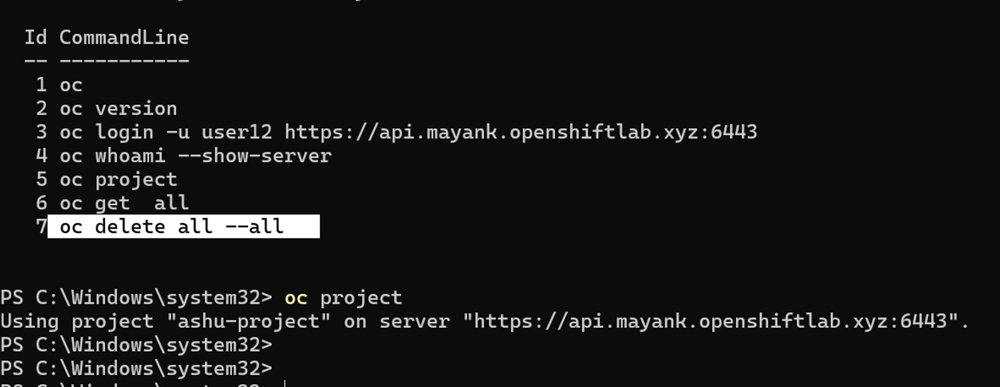
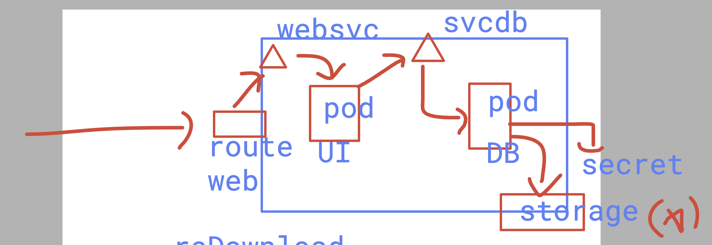

## clean project data 



### webapp 2 tier to deploy 



## deployinng wbeapp

```
===> creating db secret to root password 

oc  create  secret generic  ashu-db-creds  --from-literal mypass="Adobe@1234"  --dry-run=client -o yaml >dbsecret.yaml 
[user12@ip-172-31-28-96 2twebapp]$ oc create -f dbsecret.yaml 
secret/ashu-db-creds created
[user12@ip-172-31-28-96 2twebapp]$ oc get secret
NAME                       TYPE                             DATA   AGE
ashu-azure-secret          kubernetes.io/dockerconfigjson   1      23h
ashu-db-creds              Opaque                           1      6s

```


