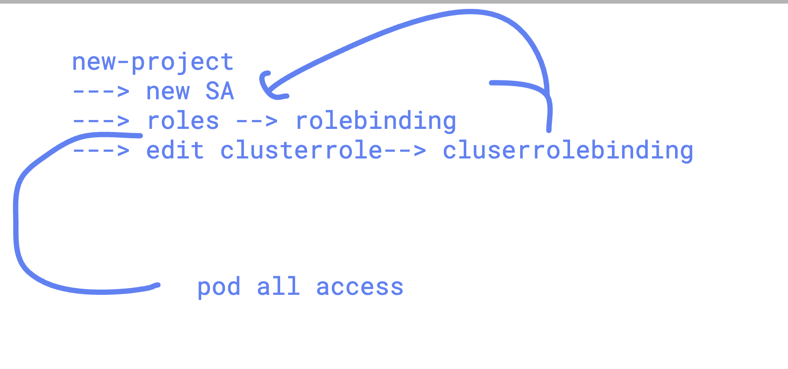

## clean project data 


### webapp 2 tier to deploy 


## deployinng wbeapp

```
===> creating db secret to root password 

oc  create  secret generic  ashu-db-creds  --from-literal mypass="Adobe@1234"  --dry-run=client -o yaml >dbsecret.yaml 
[user12@ip-172-31-28-96 2twebapp]$ oc create -f dbsecret.yaml 
secret/ashu-db-creds created
[user12@ip-172-31-28-96 2twebapp]$ oc get secret
NAME                       TYPE                             DATA   AGE
ashu-azure-secret          kubernetes.io/dockerconfigjson   1      23h
ashu-db-creds              Opaque                           1      6s


===> creating  deployment 

oc create  deployment  ashudb --image adobe.azurecr.io/adobe:mysql --port  3306  --dry-run=client -o yaml >db-deploy.yaml


===> update the yaml with secret & env 

[user12@ip-172-31-28-96 2twebapp]$ oc create -f db-deploy.yaml 
deployment.apps/ashudb created
[user12@ip-172-31-28-96 2twebapp]$ oc get deploy
NAME     READY   UP-TO-DATE   AVAILABLE   AGE
ashudb   1/1     1            1           17s
[user12@ip-172-31-28-96 2twebapp]$ oc get rs
NAME                DESIRED   CURRENT   READY   AGE
ashudb-5c595986bb   1         1         1       23s
[user12@ip-172-31-28-96 2twebapp]$ oc get pod
NAME                      READY   STATUS    RESTARTS   AGE
ashudb-5c595986bb-wjshq   1/1     Running   0          26s
[user12@ip-172-31-28-96 2twebapp]$ 

===> connecting to Db 

[user12@ip-172-31-28-96 ~]$ oc get po 
NAME                      READY   STATUS    RESTARTS   AGE
ashudb-5c595986bb-wjshq   1/1     Running   0          6m10s
[user12@ip-172-31-28-96 ~]$ oc rsh  ashudb-5c595986bb-wjshq 
sh-5.1# 
sh-5.1# 
sh-5.1# 
sh-5.1# mysql -u root -p
Enter password: 
Welcome to the MySQL monitor.  Commands end with ; or \g.
Your MySQL connection id is 9
Server version: 9.6.0 MySQL Community Server - GPL

Copyright (c) 2000, 2026, Oracle and/or its affiliates.

Oracle is a registered trademark of Oracle Corporation and/or its
affiliates. Other names may be trademarks of their respective
owners.

Type 'help;' or '\h' for help. Type '\c' to clear the current input statement.

mysql> 


```

### Creating service for DB 

```
user12@ip-172-31-28-96 2twebapp]$ ls
db-deploy.yaml  dbsecret.yaml
[user12@ip-172-31-28-96 2twebapp]$ oc  get deploy
NAME     READY   UP-TO-DATE   AVAILABLE   AGE
ashudb   1/1     1            1           11m
[user12@ip-172-31-28-96 2twebapp]$ oc  expose deploy ashudb --port 3306 --dry-run=client -o yaml >dbsvc.yml
[user12@ip-172-31-28-96 2twebapp]$ 
[user12@ip-172-31-28-96 2twebapp]$ 
[user12@ip-172-31-28-96 2twebapp]$ oc create -f dbsvc.yml 
service/ashudb created
[user12@ip-172-31-28-96 2twebapp]$ oc get svc
NAME     TYPE        CLUSTER-IP      EXTERNAL-IP   PORT(S)    AGE
ashudb   ClusterIP   172.30.66.208   <none>        3306/TCP   4s
[user12@ip-172-31-28-96 2twebapp]$ 
[user12@ip-172-31-28-96 2twebapp]$ oc get ep 
NAME     ENDPOINTS          AGE
ashudb   10.131.0.64:3306   10s
[user12@ip-172-31-28-96 2twebapp]$ 


```

## Deploy webapp

```
 oc create  deployment  ashu-web  --image adobe.azurecr.io/adobe:adminer    --port 8080 --dry-run=client -o yaml >web-deploy.yaml

 ===> update yaml file 

 oc create -f web-deploy.yaml 
deployment.apps/ashu-web created
[user12@ip-172-31-28-96 2twebapp]$ oc get deploy
NAME       READY   UP-TO-DATE   AVAILABLE   AGE
ashu-web   0/1     1            0           10s
ashudb     1/1     1            1           22m
[user12@ip-172-31-28-96 2twebapp]$ oc get po
NAME                        READY   STATUS    RESTARTS   AGE
ashu-web-5b444dd958-6sqdf   1/1     Running   0          10s
ashudb-5c595986bb-wjshq     1/1     Running   0          22m
[user12@ip-172-31-28-96 2twebapp]$ 


===> creating service 

user12@ip-172-31-28-96 2twebapp]$ oc get  deploy
NAME       READY   UP-TO-DATE   AVAILABLE   AGE
ashu-web   1/1     1            1           2m48s
ashudb     1/1     1            1           25m
[user12@ip-172-31-28-96 2twebapp]$ 
[user12@ip-172-31-28-96 2twebapp]$ oc  expose deploy ashu-web   --port  8080 --dry-run=client -o yaml >web-svc.yaml 
[user12@ip-172-31-28-96 2twebapp]$ 
[user12@ip-172-31-28-96 2twebapp]$ oc create -f web-svc.yaml 
service/ashu-web created
[user12@ip-172-31-28-96 2twebapp]$ oc get  svc
NAME       TYPE        CLUSTER-IP       EXTERNAL-IP   PORT(S)    AGE
ashu-web   ClusterIP   172.30.240.136   <none>        8080/TCP   6s
ashudb     ClusterIP   172.30.66.208    <none>        3306/TCP   15m
[user12@ip-172-31-28-96 2twebapp]$ oc get  ep
NAME       ENDPOINTS          AGE
ashu-web   10.129.2.49:8080   10s
ashudb     10.131.0.64:3306   15m
[user12@ip-172-31-28-96 2twebapp]$ 


===> creating route 

oc  expose  svc ashu-web  --dry-run=client -o yaml
apiVersion: v1
kind: Route
metadata:
  creationTimestamp: null
  labels:
    app: ashu-web
  name: ashu-web
spec:
  port:
    targetPort: 8080
  to:
    kind: ""
    name: ashu-web
    weight: null
status: {}
[user12@ip-172-31-28-96 2twebapp]$ oc  expose  svc ashu-web  --dry-run=client -o yaml >route.yaml
[user12@ip-172-31-28-96 2twebapp]$ 
[user12@ip-172-31-28-96 2twebapp]$ oc create -f route.yaml 
error: resource mapping not found for name: "ashu-web" namespace: "" from "route.yaml": no matches for kind "Route" in version "v1"
ensure CRDs are installed first
[user12@ip-172-31-28-96 2twebapp]$ oc  expose  svc ashu-web  
route/ashu-web exposed
[user12@ip-172-31-28-96 2twebapp]$ 
[user12@ip-172-31-28-96 2twebapp]$ 
[user12@ip-172-31-28-96 2twebapp]$ 
[user12@ip-172-31-28-96 2twebapp]$ oc get  route
NAME       HOST/PORT                                            PATH   SERVICES   PORT   TERMINATION   WILDCARD
ashu-web   ashu-web-ashu-project.apps.mayank.openshiftlab.xyz          ashu-web   8080                 None
[user12@ip-172-31-28-96 2twebapp]$ 
[user12@ip-172-31-28-96 2twebapp]$ 


```


## task 



## TASK rbac

### creating 

```
[root@openshift ashu]# oc whoami
kube:admin
[root@openshift ashu]# oc  new-project  ashu-task
Now using project "ashu-task" on server "https://api.mayank.openshiftlab.xyz:6443".

You can add applications to this project with the 'new-app' command. For example, try:

    oc new-app rails-postgresql-example

to build a new example application in Ruby. Or use kubectl to deploy a simple Kubernetes application:

    kubectl create deployment hello-node --image=registry.k8s.io/e2e-test-images/agnhost:2.43 -- /agnhost serve-hostname

[root@openshift ashu]# oc  project
Using project "ashu-task" on server "https://api.mayank.openshiftlab.xyz:6443".
[root@openshift ashu]# oc get  sa
NAME       SECRETS   AGE
builder    1         19s
default    1         19s
deployer   1         19s
[root@openshift ashu]# 


===> creating sa

oc create serviceaccount  ashu --dry-run=client -oyaml 
apiVersion: v1
kind: ServiceAccount
metadata:
  creationTimestamp: null
  name: ashu
[root@openshift ashu]# oc create serviceaccount  ashu
serviceaccount/ashu created
[root@openshift ashu]# oc get  sa
NAME       SECRETS   AGE
ashu       1         4s
builder    1         93s
default    1         93s
deployer   1         93s
[root@openshift ashu]# 


===> creating role 

oc create role pod-manager --verb=get,list,watch,create,delete,patch  --resource=pods --dry-run=client  -o yaml >role1.yaml
[root@openshift ashu]# oc create -f role1.yaml 
role.rbac.authorization.k8s.io/pod-manager created
[root@openshift ashu]# 
[root@openshift ashu]# 
[root@openshift ashu]# oc get roles
NAME          CREATED AT
pod-manager   2026-04-07T10:23:43Z
[root@openshift ashu]# 

```
