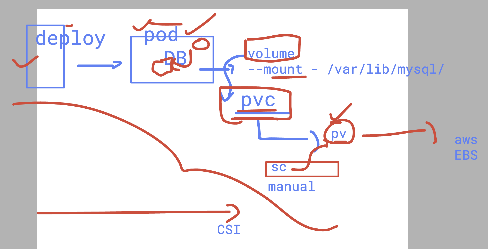

## enable bash completion for oc 

```
[user12@ip-172-31-28-96 ~]$ oc completion bash > ~/.oc_bash_completion
[user12@ip-172-31-28-96 ~]$ 
[user12@ip-172-31-28-96 ~]$ 
[user12@ip-172-31-28-96 ~]$ source  ~/.oc_bash_completion 
[user12@ip-172-31-28-96 ~]$ 
[user12@ip-172-31-28-96 ~]$ oc get  
Display all 227 possibilities? (y or n)
[user12@ip-172-31-28-96 ~]$ oc get  n
namespaces                                      networks.operator.openshift.io
network-attachment-definitions.k8s.cni.cncf.io  nodes
networkpolicies.networking.k8s.io               nodes.config.openshift.io
networks.config.openshift.io                    nodes.metrics.k8s.io
[user12@ip-172-31-28-96 ~]$ oc get  n


```

### attach pvc to your Db 

```
oc replace -f db-deploy.yaml --force 
deployment.apps "ashudb" deleted
deployment.apps/ashudb replaced
[user12@ip-172-31-28-96 2twebapp]$ oc get deploy
NAME       READY   UP-TO-DATE   AVAILABLE   AGE
ashu-web   2/2     2            2           21h
ashudb     0/1     1            0           6s
[user12@ip-172-31-28-96 2twebapp]$ oc get po 
NAME                        READY   STATUS              RESTARTS   AGE
ashu-web-5b444dd958-6sqdf   1/1     Running             1          21h
ashu-web-5b444dd958-rg57h   1/1     Running             1          21h
ashudb-6d657fcb98-kp96t     0/1     ContainerCreating   0          9s
[user12@ip-172-31-28-96 2twebapp]$ oc get pvc
NAME       STATUS   VOLUME                                     CAPACITY   ACCESS MODES   STORAGECLASS   VOLUMEATTRIBUTESCLASS   AGE
ashu-pvc   Bound    pvc-bc755d1c-6d48-4108-862b-9664d9e72bea   10Gi       RWO            gp3-csi        <unset>                 11m
[user12@ip-172-31-28-96 2twebapp]$ oc get po 
NAME                        READY   STATUS    RESTARTS   AGE
ashu-web-5b444dd958-6sqdf   1/1     Running   1          21h
ashu-web-5b444dd958-rg57h   1/1     Running   1          21h
ashudb-6d657fcb98-kp96t     1/1     Running   0          20s

```

## example to implement 



## CRD -- 

```
oc get  crd
NAME                                                              CREATED AT
adminnetworkpolicies.policy.networking.k8s.io                     2026-04-04T14:35:10Z
adminpolicybasedexternalroutes.k8s.ovn.org                        2026-04-04T14:35:10Z
alertingrules.monitoring.openshift.io                             2026-04-04T14:28:40Z
alertmanagerconfigs.monitoring.coreos.com                         2026-04-04T14:29:07Z

```

### co 

```
oc get  co 
NAME                                       VERSION   AVAILABLE   PROGRESSING   DEGRADED   SINCE   MESSAGE
authentication                             4.16.0    True        False         False      5m39s   
baremetal                                  4.16.0    True        False         False      3d15h   
cloud-controller-manager                   4.16.0    True        False         False      3d15h   
cloud-credential                           4.16.0    True        False         False      3d15h   
cluster-autoscaler                         4.16.0    True        False         False      3d15h   

```

### checking apiserver endpoints 

```
[user12@ip-172-31-28-96 ~]$ oc get  --raw /healthz
ok[user12@ip-172-31-28-96 ~]$ oc get  --raw /
{
  "paths": [
    "/.well-known/openid-configuration",
    "/api",
    "/api/v1",
    "/apis",
    "/apis/",
    "/apis/admissionregistration.k8s.io",
    "/apis/admissionregistration.k8s.io/v1",
    "/apis/apiextensions.k8s.io",
    "/apis/apiextensions.k8s.io/v1",
    "/apis/apiregistration.k8s.io",
    "/apis/apiregistration.k8s.io/v1",
    "/apis/apiserver.openshift.io",

```

===> 

```
[user12@ip-172-31-28-96 ~]$ oc adm top pod -A  --sort-by='cpu'
NAMESPACE                                          NAME                                                          CPU(cores)   MEMORY(bytes)   
openshift-monitoring                               prometheus-k8s-0                                              2155m        3065Mi          
openshift-marketplace                              redhat-operators-n62g9                                        1666m        2063Mi          
openshift-monitoring                               prometheus-k8s-1                                              1488m        3107Mi          
openshift-kube-apiserver                           kube-apiserver-ip-10-0-15-44.ec2.internal                     721m         3040Mi          
openshift-kube-apiserver                           kube-apiserver-ip-10-0-125-135.ec2.internal                   642m         3354Mi          
openshift-kube-apiserver                           kube-apiserver-ip-10-0-15-19.ec2.internal                     627m         3266Mi          
openshift-etcd                                     etcd-ip-10-0-15-44.ec2.internal                               211m         591Mi           
openshift-etcd                                     etcd-ip-10-0-125-135.ec2.internal                             201m         601Mi           

```

### oc debug to login in ocp nodes via chroot filesystem options

```
[user12@ip-172-31-28-96 ~]$ oc get node
NAME                           STATUS   ROLES                  AGE     VERSION
ip-10-0-0-72.ec2.internal      Ready    worker                 3d16h   v1.29.5+29c95f3
ip-10-0-101-140.ec2.internal   Ready    worker                 4h18m   v1.29.5+29c95f3
ip-10-0-125-135.ec2.internal   Ready    control-plane,master   3d16h   v1.29.5+29c95f3
ip-10-0-125-231.ec2.internal   Ready    worker                 3d16h   v1.29.5+29c95f3
ip-10-0-15-19.ec2.internal     Ready    control-plane,master   3d16h   v1.29.5+29c95f3
ip-10-0-15-44.ec2.internal     Ready    control-plane,master   3d16h   v1.29.5+29c95f3
ip-10-0-35-84.ec2.internal     Ready    worker                 3d16h   v1.29.5+29c95f3
ip-10-0-87-190.ec2.internal    Ready    worker                 4h18m   v1.29.5+29c95f3
[user12@ip-172-31-28-96 ~]$ oc  debug node/ip-10-0-87-190.ec2.internal
Temporary namespace openshift-debug-dwfft is created for debugging node...
Starting pod/ip-10-0-87-190ec2internal-debug-pr8nw ...
To use host binaries, run `chroot /host`
Pod IP: 10.0.87.190
If you don't see a command prompt, try pressing enter.
sh-5.1# chroot /host
sh-5.1# free -m
               total        used        free      shared  buff/cache   available
Mem:           15807        4952        4459          66        6825       10854
Swap:              0           0           0
sh-5.1# crictl  ps 
CONTAINER           IMAGE                                                                                                                               CREATED             STATE               NAME                                 ATTEMPT             POD ID              POD
ad8c7604a1e74       a3ecd26c734662caa005f5b33c3040cbd875351006fae7b15f21573e6b2fef27                                                                    26 seconds ago      Running             adobe                                0                   0ed8fc966bf57       sacdb-6fccdc49f6-m74w5

```


