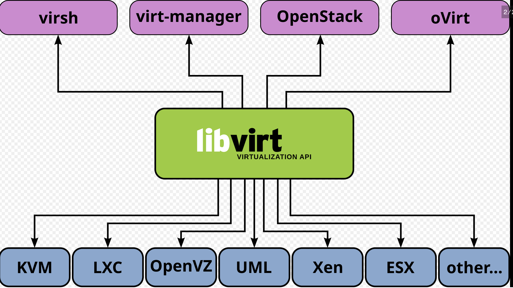
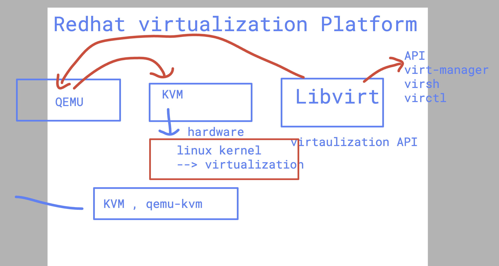

# Adobe_ocp280

```
 oc create sa adobe 

 oc adm policy add-scc-to-user anyuid -z adobe -n ashu-project

 oc run ashupod1 --image adobe.azurecr.io/adobe:alpine --command sleep 1000  --dry-run=client -o yaml  >tasksa.yaml 

 ===> refer from yaml file the changes
```

## LIbvirt 



### Qemu-KVM 



###  libvirt 


